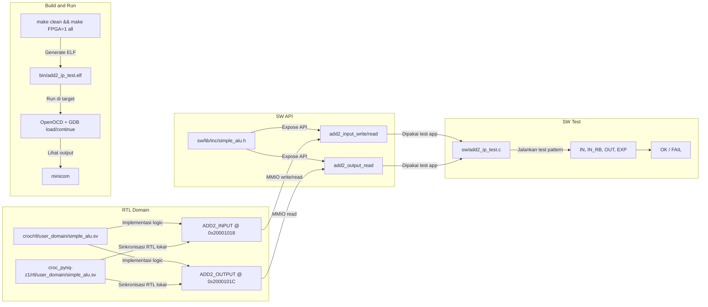

# Dokumentasi Implementasi IP Add+2 (RW Input/Output 16-bit)

## 1. Ringkasan
Dokumen ini menjelaskan implementasi IP sederhana yang melakukan operasi **tambah 2** pada data input 16-bit, dengan skema:
- **Input register 16-bit** (writeable)
- **Output register 16-bit** (readable)

Implementasi dilakukan pada user peripheral (`simple_alu`) yang terhubung ke bus OBI di domain user CROC PYNQ-Z1.

Hasil akhir pengujian:
- Data input berhasil ditulis ke register input.
- Readback input sesuai dengan data tulis.
- Output selalu sama dengan `input + 2` (dengan wrap-around 16-bit).

## 2. Tujuan
- Menambahkan IP “Add +2” berbasis register memory-mapped.
- Menyediakan akses software untuk:
  - menulis input,
  - membaca input (readback),
  - membaca output.
- Memvalidasi perilaku IP melalui program C terpisah.

## 3. Spesifikasi Register
### 3.1 Base Address
- `USER_ALU_BASE_ADDR = 0x20001000`

### 3.2 Register Map IP Add+2
1. Input Register (`ADD2_INPUT`)
- Offset: `0x18` (24 desimal)
- Alamat absolut: `0x20001018`
- Akses: Write/Read
- Lebar efektif: 16-bit (`[15:0]`)

2. Output Register (`ADD2_OUTPUT`)
- Offset: `0x1C` (28 desimal)
- Alamat absolut: `0x2000101C`
- Akses: Read
- Lebar efektif: 16-bit (`[15:0]`)
- Nilai: `ADD2_INPUT + 2` (modulo 16-bit)

## 4. Mekanisme Kerja IP
Saat software menulis nilai `x` ke `ADD2_INPUT`:
1. Register input menyimpan `x`.
2. Register output diperbarui menjadi `x + 2`.
3. Jika overflow, hasil dibungkus 16-bit (wrap-around).

Contoh:
- `0x0001 + 2 = 0x0003`
- `0xFFFF + 2 = 0x0001` (karena hanya 16-bit bawah yang disimpan)

## 5. File yang Diubah
| No | File | Jenis | Perubahan |
|---|---|---|---|
| 1 | `croc/rtl/user_domain/simple_alu.sv` | RTL | Tambah mode `Add2Input (0x18)` dan `Add2Output (0x1C)`, register input/output 16-bit |
| 2 | `croc_pynq-z1/rtl/user_domain/simple_alu.sv` | RTL | Sinkronisasi perubahan RTL Add+2 |
| 3 | `croc_pynq-z1/sw/lib/inc/simple_alu.h` | SW API | Tambah `ADD2_INPUT_OFFSET`, `ADD2_OUTPUT_OFFSET`, dan helper function add2 |
| 4 | `croc_pynq-z1/sw/add2_ip_test.c` | SW Test | Program uji IP Add+2 (HEX + DEC unsigned/signed) |

## 6. API Software Add+2
File: `sw/lib/inc/simple_alu.h`

Helper yang digunakan:
- `add2_input_write(uint16_t value)`
- `add2_input_read(void)`
- `add2_output_read(void)`

Definisi offset:
- `ADD2_INPUT_OFFSET = 24`
- `ADD2_OUTPUT_OFFSET = 28`

## 7. Program Uji
File: `sw/add2_ip_test.c`

Alur test:
1. Inisialisasi UART.
2. Menulis beberapa pola 16-bit ke input register.
3. Membaca kembali input (`IN_RB`).
4. Membaca output IP (`OUT`).
5. Menghitung ekspektasi software (`EXP = IN + 2`).
6. Mencetak status `OK/FAIL`.

Pola yang diuji:
- `0x0000`
- `0x0001`
- `0x0010`
- `0x1234`
- `0x7FFE`
- `0xFFFF`

Format output:
- HEX
- DEC unsigned
- DEC signed

Contoh format per baris:
`IDX=01 IN=0x0001(1/1) IN_RB=0x0001(1/1) OUT=0x0003(3/3) EXP=0x0003(3/3) -> OK`

## 8. Build dan Eksekusi
### 8.1 Build software
```bash
cd /home/devan/SoC/croc_pynq-z1/sw
make clean && make FPGA=1 all
```

### 8.2 Regenerate dan program bitstream (wajib setelah RTL berubah)
```bash
cd /home/devan/SoC/croc_pynq-z1/xilinx
./implement_pynqz1.sh
```

### 8.3 Load program via OpenOCD + GDB
Contoh urutan command:
```gdb
target remote localhost:3335
monitor reset halt
load
set {unsigned int}0x03000000 = 0x10000000
set {unsigned int}0x03000004 = 1
set $pc = 0x10000000
continue
```

### 8.4 Pantau serial
```bash
minicom -o -D /dev/ttyUSB0 -b 115200
```

## 9. Interpretasi Output
Makna kolom:
- `IN`   : nilai yang ditulis ke register input.
- `IN_RB`: nilai readback register input.
- `OUT`  : nilai register output dari IP add+2.
- `EXP`  : nilai harapan software (`IN + 2`).

Kriteria lulus per baris:
- `IN_RB == IN`
- `OUT == EXP`

Kriteria lulus akhir:
- semua baris `OK`
- muncul `PASS: ADD2 IP valid untuk semua pola.`

## 10. Hasil Validasi
Berdasarkan output serial yang diperoleh:
- Seluruh test case menunjukkan `OK`.
- Kasus batas (`0xFFFF`) menghasilkan `0x0001` sesuai wrap-around 16-bit.

Kesimpulan:
- IP Add+2 berfungsi benar untuk skenario RW input/output 16-bit.

## 11. Diagram Arsitektur Relasi File


## 12. Catatan Pengembangan Lanjut
- Jika ingin IP aritmetika lain (misalnya `+N`, `-2`, saturating add), cukup tambah offset register baru dan API serupa.
- Pertahankan format output test yang konsisten agar mudah dibandingkan antar versi RTL.
